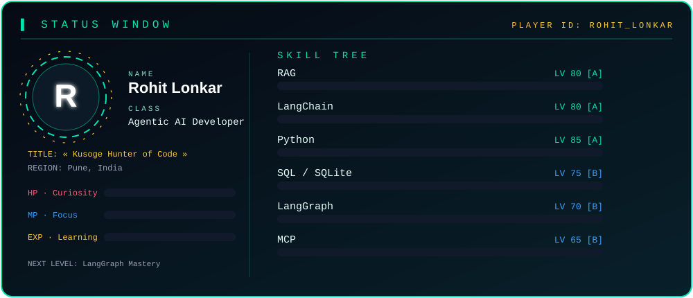
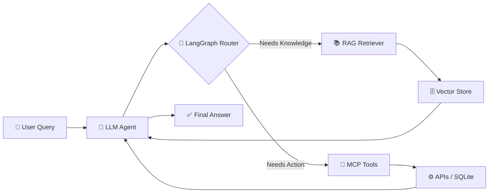

<div align="center">



<a href="https://git.io/typing-svg">

</a>

<br/>


<br/><br/>

<a href="https://linkedin.com/in/rohit-lonkar-746948274"></a>
<a href="https://github.com/rohitlonkar2006"></a>
<a href="https://x.com/lonkarrohit77"></a>
<a href="mailto:lonkarrohit77@gmail.com"></a>

</div>



## 🎮 Player Status

<div align="center">

</div>


## 🚀 About Me

```python
class Rohit:
    role      = "Computer Engineering Student & AI Developer"
    region    = "Pune, India 📍"
    title     = "Kusoge Hunter of Code ⚔️"
    focus     = ["Agentic AI", "RAG", "Multi-Agent Systems"]
    main_gear = ["LangChain", "LangGraph", "MCP", "Python"]
    next_goal = "Deploy powerful AI agents to production 🚀"
```

- 🤖 Building **Agentic AI applications** that reason, plan and act
- 🔗 Designing LLM workflows with **LangChain** and **LangGraph**
- 🧠 Implementing **Retrieval-Augmented Generation (RAG)** pipelines
- 🔌 Creating tool-using agents with **MCP (Model Context Protocol)**
- 🐍 Developing AI applications in **Python**
- 🗄️ Persisting data with **SQL and SQLite**
- 🎯 **Next goal:** deploying powerful, production-ready AI agents


## ⚡ Core AI Stack

<div align="center">


<br/>


</div>

## 🛠️ Languages & Tools

<div align="center">

</div>


## 🏆 Achievements

<div align="center">
<a href="https://github.com/rohitlonkar2006?tab=achievements">

</a>

<br/>

### 🦈 Official GitHub Achievements

<a href="https://github.com/rohitlonkar2006?achievement=pull-shark&tab=achievements">

</a>

<sub>Earned on GitHub - click the badge to view it</sub>
</div>


## 🧭 Agentic AI Workflow



## 📚 Current Quests

<div align="center">

| ⚔️ Quest | 📈 Progress |
|---|---|
| LangChain |  |
| LangGraph Workflows |  |
| MCP (Model Context Protocol) |  |
| Retrieval-Augmented Generation |  |
| 🎯 **Next quest: Deploying powerful AI agents** |  |

</div>


## 📊 GitHub Stats

<div align="center">


<br/><br/>


<br/>


</div>


## 📫 Let's Connect

<div align="center">

<a href="https://linkedin.com/in/rohit-lonkar-746948274"></a>
<a href="https://github.com/rohitlonkar2006"></a>
<a href="https://x.com/lonkarrohit77"></a>

<br/><br/>

📧 **lonkarrohit77@gmail.com**

<br/>


</div>
