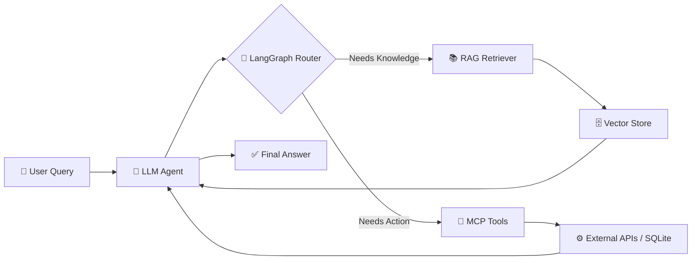

<!-- ===================== HEADER ===================== -->
<div align="center">


<a href="https://git.io/typing-svg">

</a>

<br/>


<br/><br/>

<a href="https://linkedin.com/in/rohit-lonkar-746948274"></a>
<a href="https://github.com/rohitlonkar2006"></a>
<a href="https://x.com/lonkarrohit77"></a>
<a href="mailto:lonkarrohit77@gmail.com"></a>

</div>

<br/>

---

## 🚀 About Me


```python
class Rohit:
    role      = "Computer Engineering Student & AI Developer"
    location  = "Pune, India 📍"
    focus     = ["Agentic AI", "RAG", "Multi-Agent Systems"]
    stack     = ["LangChain", "LangGraph", "MCP", "Python"]
    mission   = "Build intelligent AI applications that actually do things 🤖"
```

- 🤖 Building **Agentic AI applications** that reason, plan and act
- 🔗 Designing LLM workflows with **LangChain** & **LangGraph**
- 🧠 Implementing **Retrieval-Augmented Generation (RAG)** pipelines
- 🔌 Creating tool-using agents with **MCP (Model Context Protocol)**
- 🐍 Developing production-minded AI apps in **Python**
- 🗄️ Persisting data with **SQL & SQLite**

---

## ⚡ Core AI Stack

<div align="center">


<br/>


</div>

---

## 🛠️ Languages & Tools

<div align="center">


</div>

---

## 🧭 Agentic AI Workflow

<div align="center">



</div>

---

## 📚 Currently Learning

<div align="center">

| 🎯 Focus Area | 📈 Progress |
|---|---|
| ✨ Advanced Agentic AI |  |
| ✨ Multi-Agent Systems |  |
| ✨ Retrieval-Augmented Generation |  |
| ✨ LangGraph Workflows |  |
| ✨ MCP (Model Context Protocol) |  |

</div>

---

## 📊 GitHub Stats

<div align="center">


<br/>


<br/>


</div>

---

## 🏆 Achievements

<div align="center">


</div>

---

## 🐍 Contribution Snake

<div align="center">


</div>

<!-- Snake needs a GitHub Action; see setup notes. Delete this section if you don't want it. -->

---

## 📫 Let's Connect

<div align="center">

<a href="https://linkedin.com/in/rohit-lonkar-746948274"></a>
<a href="https://github.com/rohitlonkar2006"></a>
<a href="https://x.com/lonkarrohit77"></a>

<br/><br/>

📧 **lonkarrohit77@gmail.com**

<br/>


</div>
